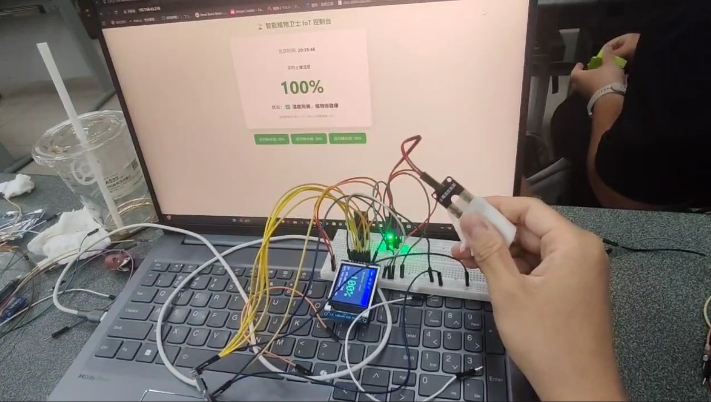
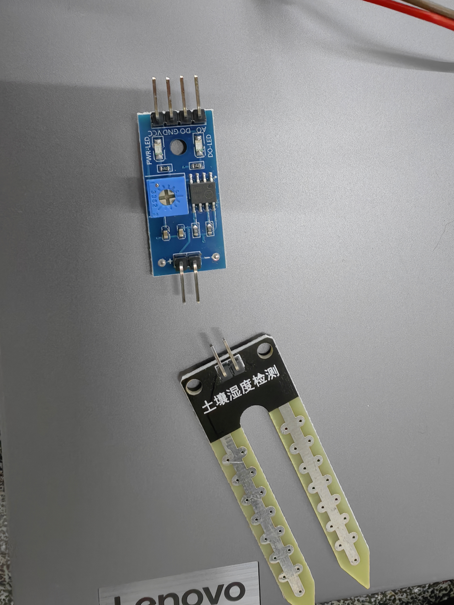
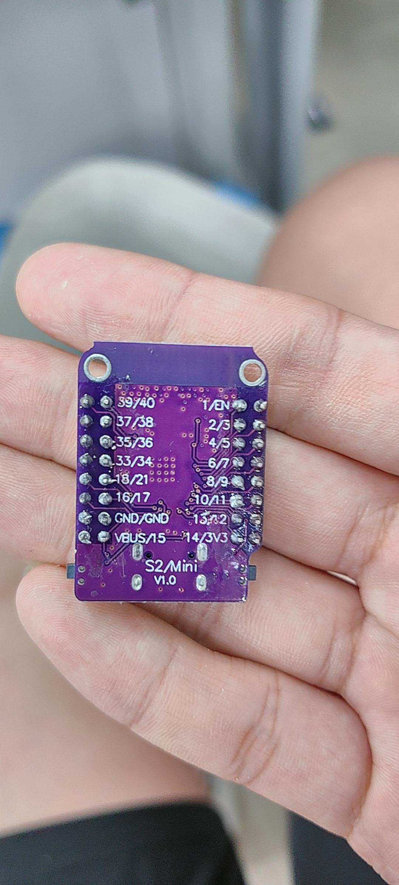

# 🚀 从代码到实物：课程项目日志 (Course Project Record)

本仓库用于记录在《从代码到实物》课程中的完整实践过程，涵盖从理论推演、软硬件结合测试，到最终完成物理实体项目的全生命周期。

---

## 01 | 个人档案
* **姓名：** 黄新雄
* **专业：** 计算机科学与技术
* **学校：** 西南交通大学
* **简述：** 致力于探索虚拟代码与物理现实的边界，对底层硬件逻辑、嵌入式开发及物联网控制有浓厚兴趣。

## 02 | 什么是创客 (Maker Philosophy)
创客（Maker）是一群热衷于将创意转化为现实的人，核心在于**动手实践**与**跨界融合**。
在数字时代，我们利用 3D 打印机、激光切割、开源硬件（如 ESP32）以及代码逻辑，去创造能够感知和影响真实世界的物理实体。创客精神的核心就是不断试错并在物理法则中解决实际问题。

## 03 | Git 协作记录
为了保证项目代码和文档的版本迭代可追溯，本项目采用 Git 进行版本控制，并同步托管至 Gitee 与 GitHub。
* `git init`：初始化本地项目库。
* `git add .` & `git commit -m "..."`：完成本地变动的追踪与版本封存。
* `git push`：实现本地代码与云端服务器的同步。

## 04 | 3D建模与打印
**项目：致敬交大130周年校门复刻**
* **建模：** 使用 SOLIDWORKS 根据真实比例对西南交大校门进行三维建模，精细处理了内部拱门镂空与底层支撑结构。
* **打印：** 导入 Bambu Studio 切片，使用拓竹 A1 mini 3D打印机完成实体输出。经过后处理拆除支撑，顺利完成实物打卡验证。

## 05 | 电子焊接实验
完成 LED 闪灯电路板的底层物理搭建。
* **实践内容：** 预热电烙铁，将 IC 底座、LED 指示灯、色环电阻与电容通过穿孔焊接到 PCB 板上。
* **工艺要求：** 确保焊锡形成标准圆锥形焊点，避免虚焊与连锡，最终通电测试回路连通性。

## 06 | 嵌入式计算 (ESP32)
基于 ESP32 微控制器，完成了一系列底层 I/O 与网络通讯实验：
1. **串口通讯 (HelloWorld)：** 建立主控与终端的基础数据通道。
2. **数字输出：** 操控 GPIO 引脚高低电平，驱动外部 LED 闪烁。
3. **数字输入：** 搭建下拉电阻回路，通过串口绘图器实时侦测物理按键的波形跳变。
4. **模拟输出 (PWM)：** 利用脉宽调制技术实现 LED 呼吸灯渐变效果。
5. **模拟输入：** 结合光敏电阻与分压电路，实现环境光强度的连续数值采集。
6. **无线局域网 (Web Server)：** 接入局域网并分配 IP，通过 `WebServer.h` 库建立网页控制面板，实现浏览器无线控制物理舵机与板载 LED。

## 07 | 中期创客项目：复古光学摩斯密码机 V5.0
**团队成员：** 黄新雄、张欣玥
* **项目简介：** 基于 ESP32 主控，整合了光敏侦测与机械按键双路输入的摩斯密码解析系统，并在本地建立 Web Server 控制台。
* **核心算法：** 摒弃阻塞性的 `delay()`，采用基于 `millis()` 的非阻塞时间差计算。
  * **按键模式：** 按下 50ms~2s 判定为“点(.)”，>2s 判定为“划(-)”。
  * **光感模式：** 严谨防抖，遮光 2~4s 判定为“点(.)”，>4s 判定为“划(-)”。
* **硬件组装：** 面包板分压电路搭建完毕后，整体嵌入专属定制的 3D 打印外壳中，实现高度集成。

## 08 | PCB 电路板设计
依托嘉立创 EDA 工具，完成工业标准印制电路板的设计：
1. **校庆 LED 电子徽章：** 结合 AI 提取的“银杏叶”轮廓作为异形板框。规范布线法则，线宽 1mm，全板导线采用标准 45° 倒角。
2. **TP4056 锂电池充电模块：** 阅读芯片手册进行元器件选型，完成原理图绘制。PCB 布局中对 VCC 电源线进行加宽及实线填充，完成全板 GND 铺铜与 DRC 规则检验。

## 09 | 设计思维 (Design Thinking)
项目开发全流程严格遵循设计思维方法论：
* **Empathize (共情)：** 挖掘真实交互需求。
* **Define (定义)：** 锁定技术瓶颈（如光线抖动干扰）。
* **Ideate (构思)：** 设计基于时钟周期的信号过滤算法。
* **Prototype (原型)：** 使用面包板快速验证电路拓扑。
* **Test (测试)：** 软硬件联调，消除系统 Bug。

## 10 | 期末创新项目：智能植物卫士 IoT 控制台

- 项目名称： 智能植物卫士 IoT 控制台
- 项目类型： 物联网监测 / 嵌入式开发 / 智能植物养护
- 核心主控： ESP32-S2 Mini
- 技术栈： Arduino C++、WiFi WebServer、TFT 屏幕显示、ADC 模拟量采集、NTP 网络时间同步

### 项目简介

本项目基于 ESP32-S2 Mini 主控板，结合土壤湿度传感器、TFT 彩屏、蜂鸣器与 WiFi Web Server，
实现了一个能够实时检测土壤湿度、网页远程查看、缺水报警、报警阈值设置以及本地屏幕显示的智能植物养护系统。

系统会将土壤湿度传感器采集到的模拟量转换为 0%~100% 的湿度百分比，并同时显示在本地 TFT 屏幕和网页控制台中。
当湿度低于设定阈值时，蜂鸣器会自动间歇报警，网页端也会显示红色缺水警告。用户还可以通过网页按钮切换报警线，
或在报警时手动关闭蜂鸣器。

### 团队分工

| 姓名   | 职责      | 具体工作                                  |
| ------ | --------- | ----------------------------------------- |
| 李露   | 软件/代码 | 主代码编写、串口调试、系统集成、文档编写  |
| 黄新雄 | 硬件/电路 | 杜邦线接线、电路调试、焊接、分压电路      |
| 李瑛琪 | 3D建模    | Fusion 360 外壳设计、Bambu Lab 打印、组装 |
| 刘知行 | 测试/文档 | 功能测试、演示准备、物料协调、拍照记录    |
| 唐宇涵 | 组装/调试 | 外壳组装、热熔胶固定、走线理线、现场演示  |

### 硬件组成

- ESP32-S2 Mini 主控板：负责 WiFi 通信、传感器读取、网页服务和屏幕驱动。
- 土壤湿度传感器：用于检测土壤含水量，并输出模拟电压信号。
- TFT 彩屏：用于本地显示时间、湿度、IP 地址和植物状态。
- 蜂鸣器：当湿度低于报警阈值时进行声音提醒。
- 面包板与杜邦线：用于快速搭建和调试原型电路。
- 3D 打印外壳：用于固定主控板、屏幕与传感器模块，提高作品完整度。

### 研发纪要

1. 传感器校准  
   首先将土壤湿度传感器分别置于空气中和水中，通过串口读取干燥值与湿润值。
   最终设置 `dryValue = 4095`，`wetValue = 1500`，再使用 `map()` 将 ADC 原始值映射为湿度百分比。

2. TFT 屏幕调试  
   屏幕采用 ST7735 驱动库，通过软件 SPI 自定义引脚连接。
   调试过程中解决了屏幕初始化、显示方向、刷新闪烁等问题，并使用局部刷新方式减少画面闪烁。

3. Web 控制台开发  
   使用 `WebServer.h` 搭建局域网网页服务。网页端能够显示北京时间、实时湿度、报警状态、报警阈值和 ADC 原始值。
   同时提供 20%、30%、50% 三档报警线切换按钮，以及蜂鸣器静音按钮。

4. 缺水报警逻辑  
   当湿度低于报警线且未静音时，蜂鸣器会以 300ms 为周期间歇鸣叫。
   为了避免网页服务阻塞，报警逻辑没有使用 `delay()`，而是基于 `millis()` 实现非阻塞控制。

5. 网络时间同步  
   设备连接 WiFi 后，通过阿里云 NTP 服务器同步北京时间，并在网页端和 TFT 屏幕上实时显示。

6. 最终集成  
   完成面包板原型后，对传感器、屏幕、蜂鸣器和主控板进行整体接线整理，并结合 3D 打印外壳完成结构固定与现场演示。

### 成果图片记录









### 技术难点与解决方案

- ADC 数值不稳定：  
  ESP32-S2 的模拟输入需要统一分辨率，因此在初始化中加入 `analogReadResolution(12)`，保证读取范围为 0~4095。

- 屏幕刷新闪烁：  
  如果每次循环都全屏刷新，会导致肉眼可见闪烁。最终采用 `fillRect()` 局部清除区域，只刷新变化内容。

- 蜂鸣器报警与网页响应冲突：  
  若使用 `delay()` 控制蜂鸣器，会导致网页请求卡顿。因此改用 `millis()` 实现非阻塞报警。

- 土壤湿度百分比换算：  
  通过空气干燥值和完全浸水值进行标定，再使用 `map()` 与 `constrain()` 限制结果范围，使网页显示更加直观。

### 完整项目代码

> 注：为避免在公开仓库中暴露个人 WiFi 密码，下面代码中的 `password` 建议在本地烧录前自行替换为实际密码。

```cpp
#include <Arduino.h>
#include <WiFi.h>
#include <WebServer.h>
#include <Adafruit_GFX.h>
#include <Adafruit_ST7735.h>
#include <SPI.h>
#include "time.h"

// ================= 引脚定义 (专为 S2 Mini 外排针脚纯手工定制!) =================
#define TFT_CS     16   // 左侧外排
#define TFT_DC     18   // 左侧外排
#define TFT_RST    33   // 左侧外排
#define TFT_SCLK   35   // 左侧外排
#define TFT_MOSI   37   // 左侧外排

#define SOIL_PIN   4    // 右侧外排 (ADC)
#define BEEP_PIN   6    // 右侧外排
#define BEEP_ON    HIGH
#define BEEP_OFF   LOW

// ================= WiFi 配置 =================
const char* ssid = ""; 
const char* password = ""; 

const char* ntpServer = "ntp.aliyun.com";
const long  gmtOffset_sec = 8 * 3600; 
const int   daylightOffset_sec = 0;

// ================= 对象实例化 (使用软件 SPI 随意定脚) =================
Adafruit_ST7735 tft = Adafruit_ST7735(TFT_CS, TFT_DC, TFT_MOSI, TFT_SCLK, TFT_RST);
WebServer server(80);

// ================= ?? 传感器校准参数 =================
int dryValue = 4095;  // 探头拿在空气中、擦干时的 AD 数值
int wetValue = 1500;  // 探头完全泡在水里的 AD 数值

// ================= 全局变量 =================
int currentMoisture = 0;   
int rawAnalogValue = 0;    
int alarmThreshold = 30;   
bool isMuted = false;      

char currentTimeStr[20] = "Syncing...";
unsigned long lastScreenUpdate = 0; 

// ================= 网页前端代码 =================
String HtmlPage() {
  String html = "<!DOCTYPE html><html><head><meta charset='UTF-8'>";
  html += "<meta name='viewport' content='width=device-width, initial-scale=1.0'>";
  html += "<meta http-equiv='refresh' content='3'>"; 
  html += "<title>植物卫士 IoT 控制台</title>";
  html += "<style>body{text-align:center;font-family:'Segoe UI',sans-serif;background:#e8f5e9;} button{padding:12px 20px;font-size:16px;border:none;border-radius:8px;background:#4caf50;color:white;margin:5px;cursor:pointer;box-shadow: 0 2px 4px rgba(0,0,0,0.2); transition: 0.2s;} button:hover{opacity: 0.9;} .danger{background:#f44336;} .card{background:white;padding:30px;border-radius:15px;margin:20px auto;max-width:500px;box-shadow:0 10px 20px rgba(0,0,0,0.1);}</style></head><body>";
  html += "<h2 style='color:#2e7d32;'>? 智能植物卫士 IoT 控制台</h2><div class='card'>";
  html += "<p style='font-size:18px; color:#555;'>北京时间: <b>" + String(currentTimeStr) + "</b></p><hr style='border:0; border-top:1px solid #eee; margin:20px 0;'>";
  html += "<p>实时土壤湿度</p>";
  String color = currentMoisture < alarmThreshold ? "#f44336" : "#2e7d32";
  html += "<h1 style='color:" + color + ";font-size:72px;margin:10px 0;'>" + String(currentMoisture) + "%</h1>";
  if (currentMoisture < alarmThreshold) {
    html += "<p style='font-size:20px;'>状态：<b>?? 极度缺水，请立即浇水！</b></p>";
    if (isMuted) html += "<p style='color:#f44336;'>(警报已被手动静音)</p>";
    else html += "<p style='color:#f44336; animation: blink 1s infinite;'>(? 正在鸣笛报警 ?)</p>";
  } else {
    html += "<p style='font-size:20px;'>状态：<b>? 湿度完美，植物很健康</b></p>";
  }
  html += "<p style='color:#999;font-size:12px;margin-top:20px;'>当前报警线: 低于 " + String(alarmThreshold) + "% | 探头AD原始数值: " + String(rawAnalogValue) + "</p></div>";
  if (currentMoisture < alarmThreshold && !isMuted) {
    html += "<a href='/mute'><button class='danger'>? 强制关闭蜂鸣器报警</button></a><br><br>";
  }
  html += "<a href='/set20'><button>设为缺水线: 20%</button></a><a href='/set30'><button>设为缺水线: 30%</button></a><a href='/set50'><button>设为缺水线: 50%</button></a></body></html>";
  return html;
}

// ================= Web服务器路由 =================
void WebService() {
  server.on("/", []() { server.send(200, "text/html", HtmlPage()); });
  server.on("/mute", []() { isMuted = true; digitalWrite(BEEP_PIN, BEEP_OFF); server.send(200, "text/html", "<meta http-equiv='refresh' content='0; url=/'><p>已静音，正在返回...</p>"); });
  server.on("/set20", []() { alarmThreshold = 20; server.send(200, "text/html", "<meta http-equiv='refresh' content='0; url=/'><p>设置成功</p>"); });
  server.on("/set30", []() { alarmThreshold = 30; server.send(200, "text/html", "<meta http-equiv='refresh' content='0; url=/'><p>设置成功</p>"); });
  server.on("/set50", []() { alarmThreshold = 50; server.send(200, "text/html", "<meta http-equiv='refresh' content='0; url=/'><p>设置成功</p>"); });
}

void updateLocalTime() {
  struct tm timeinfo;
  if (!getLocalTime(&timeinfo)) return;
  sprintf(currentTimeStr, "%02d:%02d:%02d", timeinfo.tm_hour, timeinfo.tm_min, timeinfo.tm_sec);
}

void setup() {
  Serial.begin(115200);
  delay(100); 

  // ?? S2 特有保护：强制将模拟量分辨率设为 12 位 (0-4095)，以匹配你之前的干湿校准值！
  analogReadResolution(12);
  
  pinMode(BEEP_PIN, OUTPUT);
  digitalWrite(BEEP_PIN, BEEP_OFF);

  // 屏幕初始化 (如果花屏依然可以换成 INITR_GREENTAB)
  tft.initR(INITR_BLACKTAB); 
  tft.setRotation(1);
  tft.fillScreen(ST77XX_BLACK);
  
  tft.setTextColor(ST77XX_GREEN);
  tft.setTextSize(2);
  tft.setCursor(15, 30);
  tft.print("Plant Guard");
  
  WiFi.begin(ssid, password);
  tft.setTextColor(ST77XX_WHITE);
  tft.setTextSize(1);
  tft.setCursor(15, 60);
  tft.print("Connecting WiFi...");
  
  int retry = 0;
  while (WiFi.status() != WL_CONNECTED && retry < 20) {
    delay(500);
    retry++;
  }

  tft.fillScreen(ST77XX_BLACK);
  if (WiFi.status() == WL_CONNECTED) {
    tft.setCursor(5, 20); tft.print("WiFi Connected!");
    tft.setCursor(5, 40); tft.print("IP: "); tft.print(WiFi.localIP());
    configTime(gmtOffset_sec, daylightOffset_sec, ntpServer);
    Serial.println(WiFi.localIP());
  } else {
    tft.setTextColor(ST77XX_RED);
    tft.setCursor(5, 20); tft.print("WiFi Failed!");
    tft.setCursor(5, 40); tft.print("Offline Mode");
  }
  delay(2000);
  tft.fillScreen(ST77XX_BLACK); 

  WebService();
  server.begin();
}

void loop() {
  server.handleClient();
  updateLocalTime();

  rawAnalogValue = analogRead(SOIL_PIN);
  currentMoisture = map(rawAnalogValue, dryValue, wetValue, 0, 100);
  currentMoisture = constrain(currentMoisture, 0, 100); 

  if (currentMoisture >= alarmThreshold) {
    isMuted = false;
  }

  bool shouldAlarm = (currentMoisture < alarmThreshold) && !isMuted;
  if (shouldAlarm) {
    if ((millis() / 300) % 2 == 0) digitalWrite(BEEP_PIN, BEEP_ON);
    else digitalWrite(BEEP_PIN, BEEP_OFF);
  } else {
    digitalWrite(BEEP_PIN, BEEP_OFF);
  }

  if (millis() - lastScreenUpdate > 500) {
    lastScreenUpdate = millis();

    // 屏幕防闪烁优化绘制
    tft.fillRect(0, 0, 160, 20, ST77XX_BLUE);
    tft.setTextColor(ST77XX_WHITE); 
    tft.setTextSize(1);
    tft.setCursor(5, 6);
    tft.print("Time: ");
    tft.print(currentTimeStr);

    tft.fillRect(0, 30, 160, 20, ST77XX_BLACK); 
    if (currentMoisture < alarmThreshold) {
      tft.setTextColor(ST77XX_RED);
      tft.setTextSize(2);
      tft.setCursor(15, 35);
      tft.print("NEED WATER!");
    } else {
      tft.setTextColor(ST77XX_GREEN);
      tft.setTextSize(1);
      tft.setCursor(20, 35);
      tft.print("Moisture Level:");
    }
    
    char moistureStr[10];
    sprintf(moistureStr, "%-3d%%", currentMoisture); 
    
    if (currentMoisture < alarmThreshold) {
        tft.setTextColor(ST77XX_RED, ST77XX_BLACK);
    } else {
        tft.setTextColor(ST77XX_GREEN, ST77XX_BLACK);
    }
    tft.setTextSize(4);
    tft.setCursor(40, 60);
    tft.print(moistureStr);

    tft.setTextSize(1);
    tft.setTextColor(ST77XX_WHITE, ST77XX_BLACK);
    tft.setCursor(5, 100);
    tft.print("IP: ");
    tft.print(WiFi.localIP().toString() + "    "); 
    
    tft.setCursor(5, 115);
    tft.print("WiFi Web Control Ready");
  }
}
```

------

### 附加 | 激光切割实践 (减材制造)

**项目：校庆元素定制书签**
* **工艺流程：** 将包含校门矢量图形的设计稿导入 EagleWorks 激光加工软件。
* **参数调优：** 设定激光功率为 63.0%，切割速度 23.00 mm/s，并开启“路径优化”。成功实现木质（亚克力）材料的精准切割，边缘平滑无焦痕。